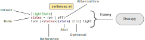

Rhasspy (pronounced RAH-SPEE) is a free, open source, [multilingual](#supported-languages) voice toolkit for Linux. It runs <strong>completely offline</strong> on devices like a [Raspberry Pi](hardware.md).

Orginally inspired by [Jasper](https://jasperproject.github.io/), Rhasspy transforms your custom voice commands into [JSON](https://json.org) events for use in home automation workflows. It integrates well with [Node-RED](https://nodered.org), [Home Assistant](https://www.home-assistant.io/), and [Hass.io](https://www.home-assistant.io/hassio/).


## How it Works

You define your custom voice commands in a [templating language](training.md) that is used to train Rhasspy. Custom speech and intent recognition models are generated during training.



Rhasspy's [various tools](tools.md) can be used from the command line...

```bash
> sox turn_on_the_light.wav -r 16000 -c 1 -e signed-integer -t raw - | \
      rhasspy-pocketsphinx \
          --acoustic-model ... \
          --dictionary ... \
          --language-model ... | \
      rhasspy-fsticuffs \
          --intent-fst ...
```

Output:

```json
          
{ 
  "text": "turn on the light",
  "intent": {"name": "LightState"},
  "slots": {"state": "on"}
}
```


...or as a constellation of [MQTT](https://mosquitto.org) services:


Check out the [available MQTT events](reference.md#mqtt-events) to get an idea of what's possible.

## Getting Started

To get started, follow the [installation guide](install.md). Once installed, you can [customize](customize.md) Rhasspy to fit your home automation needs.

## Motivation

Modern voice assistants (Alexa, Google Home, etc.) solve specific problems:

1. Deciding when to start recording ([wake word](wake-word.md))
2. Deciding when to stop recording ([command listener](command-listener.md))
3. Transcribing voice commands to text ([speech to text](speech-to-text.md))
4. Guessing the intent behind a voice command ([intent recognition](intent-recognition.md))
5. Fulfilling the speaker's intent ([intent handling](intent-handling.md))

Rhasspy provides **offline, private solutions** to problems 1-4 using open source tools:

* **Wake word**
    * [porcupine](https://github.com/Picovoice/Porcupine)
* **Command listener**
    * [webrtcvad](https://github.com/wiseman/py-webrtcvad)
* **Speech to text**
    * [Pocketsphinx](https://github.com/cmusphinx/pocketsphinx)
    * [Kaldi](https://kaldi-asr.org)
* **Intent recognition**
    * [OpenFST](https://www.openfst.org)

Fulfilling the speaker's intent (problem 5) is beyond the scope of Rhasspy. A [Node-RED flow](https://nodered.org) combined with home automation software, such as [Home Assistant automations](https://www.home-assistant.io/docs/automation/), can pick up where Rhasspy leaves off.

## Supported Languages

Rhasspy currently supports the following languages:

* English (`en`)
* German (`de`)
* Spanish (`es`)
* French (`fr`)
* Italian (`it`)
* Dutch (`nl`)
* Russian (`ru`)
* Greek (`el`)
* Hindi (`hi`)
* Mandarin (`zh`)
* Vietnamese (`vi`)
* Portuguese (`pt`)

Support for these languages comes directly from existing [CMU Sphinx](https://sourceforge.net/projects/cmusphinx/files/Acoustic%20and%20Language%20Models/) and [Kaldi](https://montreal-forced-aligner.readthedocs.io/en/latest/pretrained_models.html) acoustic models.

It is possible to extend Rhasspy to new languages with only:

* A [phonetic dictionary](https://cmusphinx.github.io/wiki/tutorialdict/#using-g2p-seq2seq-to-extend-the-dictionary)
* A trained [acoustic model](https://cmusphinx.github.io/wiki/tutorialam/)
* A [grapheme to phoneme model](https://github.com/AdolfVonKleist/Phonetisaurus)
